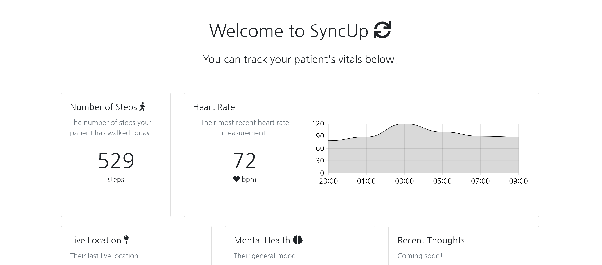
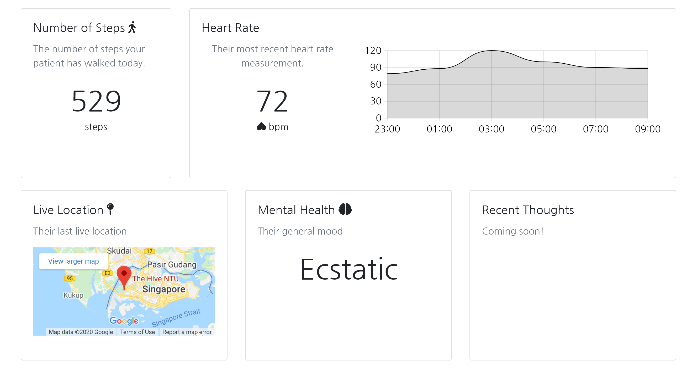

# SyncUp

## Project Description
Built during IdeasJam '20. A conceptualised medical tool to track both a patients vitals and mental health. Built using VueJS 2.7, Bootstrap 3 and FontAwesome. Hardware built using RaspberryPi 3B (for Pedometer and Tremors) and Arduino (for Pulse tracking).!



## Project setup
```
npm install
```

### Compiles and hot-reloads for development
```
npm run serve
```

### Compiles and minifies for production
```
npm run build
```

### Lints and fixes files
```
npm run lint
```
